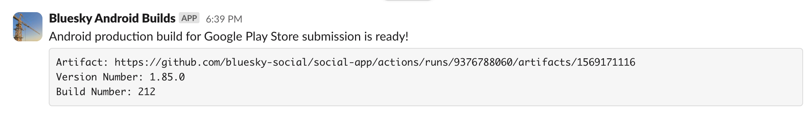

<!-- TOC start (generated with https://github.com/derlin/bitdowntoc) -->

- [OTA Deployments](#ota-deployments)
   * [Overview](#overview)
   * [Internal Deployments](#internal-deployments)
   * [Production Deployments](#production-deployments)
      + [Prerequisites](#prerequisites)
      + [Preparation](#preparation)
      + [Deployment](#deployment)
      + [Post Deployment](#post-deployment)
- [Building as a Mobile Application](#building-as-a-mobile-application)
   * [Initial Configuration](#initial-configuration)
   * [Building](#building)

<!-- TOC end -->

<!-- TOC --><a name="ota-deployments"></a>
# OTA Deployments

<!-- TOC --><a name="overview"></a>
## Overview


<!-- TOC --><a name="internal-deployments"></a>
## Internal Deployments

Internal OTA deployments happen automatically with all merges into main. If there are incompatible native changes, a new client build will run and deploy to TestFlight (iOS) or Slack (Android).

<!-- TOC --><a name="production-deployments"></a>
## Production Deployments

<!-- TOC --><a name="prerequisites"></a>
### Prerequisites

- Find the latest production build number for iOS and Android in Slack (#client-builds).
  - Look for the Version Number and Build Number.

    

- Check the current production clients for these values. Remove existing internal builds from your device to get accurate values.

  

- Log into EAS locally using `npx eas login`.
- Ensure the initial client's commit is properly tagged in git (format: 1.X.0).

<!-- TOC --><a name="preparation"></a>
### Preparation

- Create a new branch from the git tag of the initial release: `1.X.0-ota-1`.
- For subsequent deployments, increment the branch name: `1.x.0-ota-2`.
- Cherry-pick the commits you wish to deploy.
- Ensure the `package.json` version field is correct.

<!-- TOC --><a name="deployment"></a>
### Deployment

- Update the build numbers in EAS to match the production app's build numbers:
  - `npx eas build:version:set -p ios`
  - `npx eas build:version:set -p android`
  - Save these build numbers for later.

- Run the deployment:
  - Go to [GitHub Actions](https://github.com/bluesky-social/social-app/actions/workflows/bundle-deploy-eas-update.yml).
  - Select “Run Workflow”.
  
    
  
  - Choose the correct branch for the deployment.
  
    
  
  - Verify the branch selection.
  - Select the production channel.
  - Enter the client version (e.g., 1.80.0).
    - If incorrect, the deployment will fail or succeed with no updates for users.
  
    
  
  - Confirm the branch, channel, and version.
  - Click “Run Workflow”.

In about five minutes, the new deployment should be available. To test:

- Remove the internal build from your device.
- Download the app from the App Store/Google Play.
- Launch the app, wait 15 seconds, then relaunch.
- Check the Settings page for the latest commit hash.

<!-- TOC --><a name="post-deployment"></a>
### Post Deployment

- Reset both platforms' build numbers to their original values. These were logged by the EAS CLI prior to the OTA.

----

<!-- TOC --><a name="building-as-a-mobile-application"></a>
# Building as a Mobile Application

The documentation related to building the mobile application from the GitHub repository focuses on the Over-the-Air (OTA) Deployment method. This method is commonly used to distribute application updates without users needing to manually download the new version from an app store.

However, it is not possible to follow the mentioned procedures because only developers with access to the project can execute the established workflow. Therefore, the following will explain how to perform this procedure manually.

<!-- TOC --><a name="initial-configuration"></a>
## Initial Configuration

The first step is to create a new branch from a established tag of the project, this is done in order to avoid possible errors that may occur when a developer commits. Additionally, create a file named `.env.test` based on the `.env.example` file.

```bash
> git tag
1.2
1.72.0
1.73.0
1.74.0
1.75.0
1.76.0
1.77.0
1.78.0
1.79
1.80.0
1.81.0
1.82.0

> git checkout -b 1.0.0-ota-1 1.82.0
> mv .env.example .env.test
```

Next, you need to have an account created in Expo and from there create a project. In Figure 4, the project name 'temp' is observed along with the variables that are created and required for the build process.


These variables should be modified in the 'app.config.js' file located in the root of the project as shown in Figure 5.

```bash
❯ git diff app.config.js
diff --git a/app.config.js b/app.config.js
index 66a453039..761a2fab3 100644
--- a/app.config.js
+++ b/app.config.js
@@ -54,9 +54,9 @@ module.exports = function (config) {
     expo: {
       version: VERSION,
       name: 'Bluesky',
-      slug: 'bluesky',
+      slug: 'temp',
       scheme: 'bluesky',
-      owner: 'blueskysocial',
+      owner: 'cromozzc',
       runtimeVersion: {
         policy: 'appVersion',
       },
@@ -228,7 +228,7 @@ module.exports = function (config) {
               },
             },
           },
-          projectId: '55bd077a-d905-4184-9c7f-94789ba0f302',
+          projectId: '38440e6d-394a-467b-8472-6ac79b615aa2',
         },
       },
       hooks: {
```

<!-- TOC --><a name="building"></a>
## Building

First, it is necessary to install the EAS command-line tool globally using the command `npm install -g eas-cli`. Then, log in to the EAS account using `eas login`.

To verify that you have logged in successfully, use the command `eas whoami`. Next, proceed to build the application for the Android platform using `eas build --platform android`.

Finally, execute `eas build` to start the complete build process. These steps ensure that the application is compiled properly and is ready for further distribution.


```bash
npm install -g eas-cli
eas login
eas whoami
eas build --platform android
eas build
```


